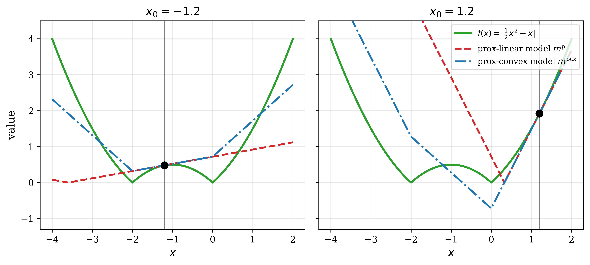
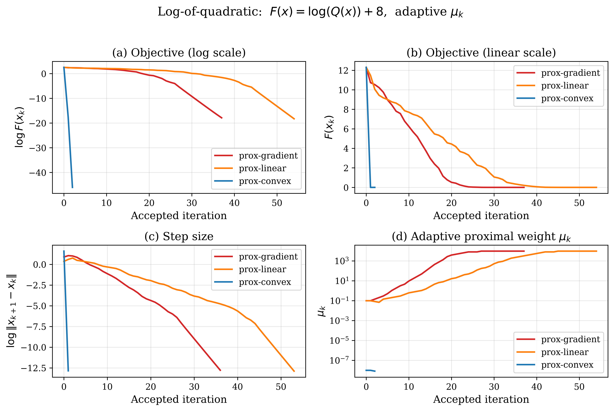
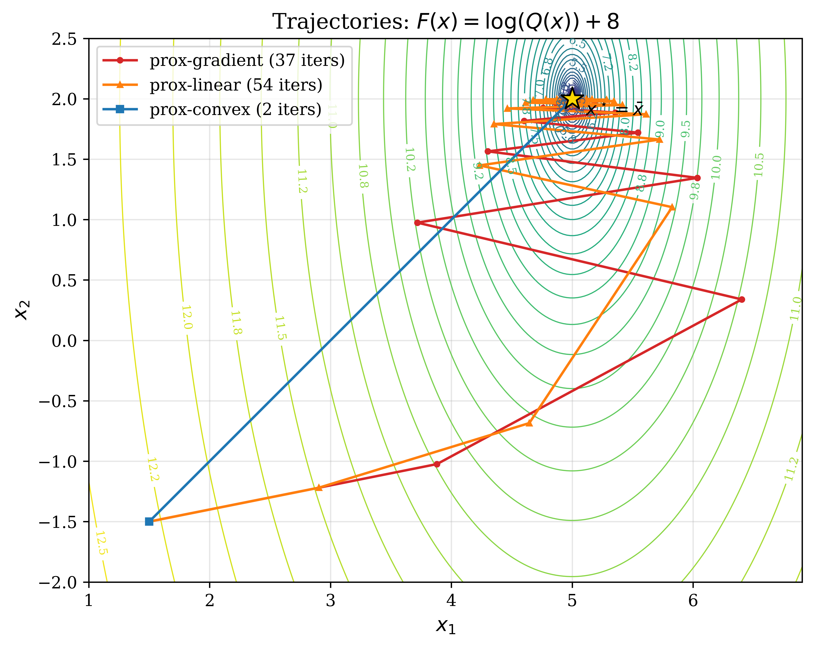
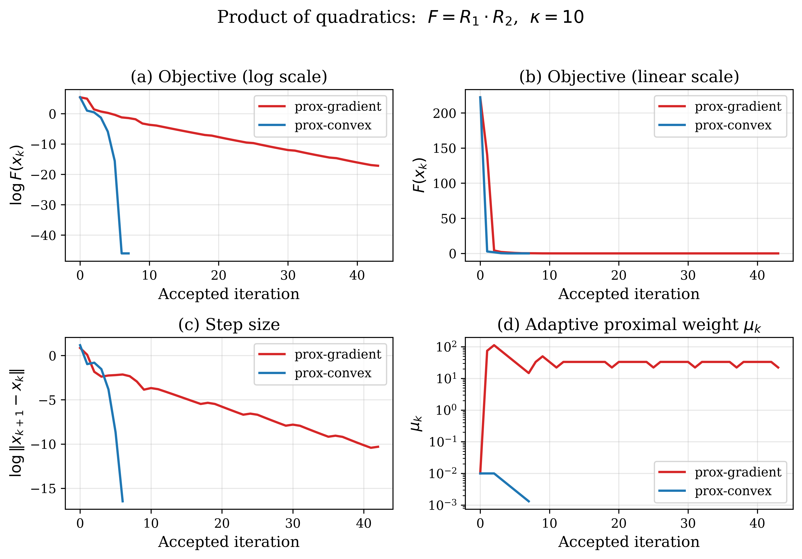
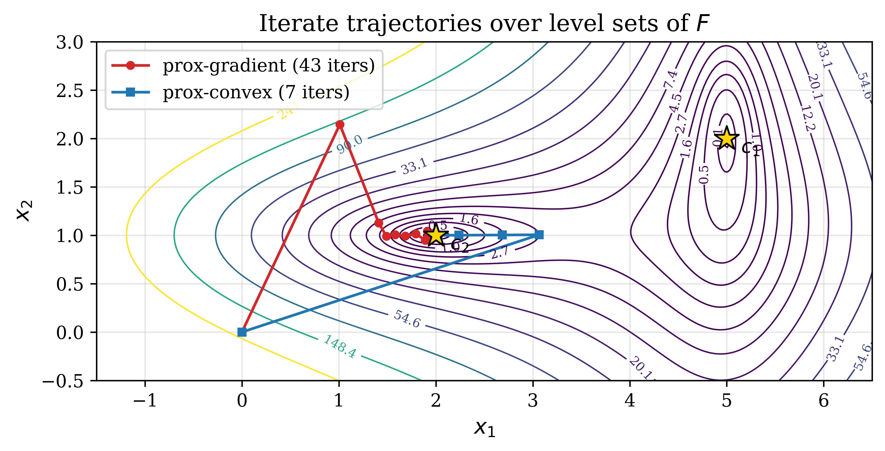
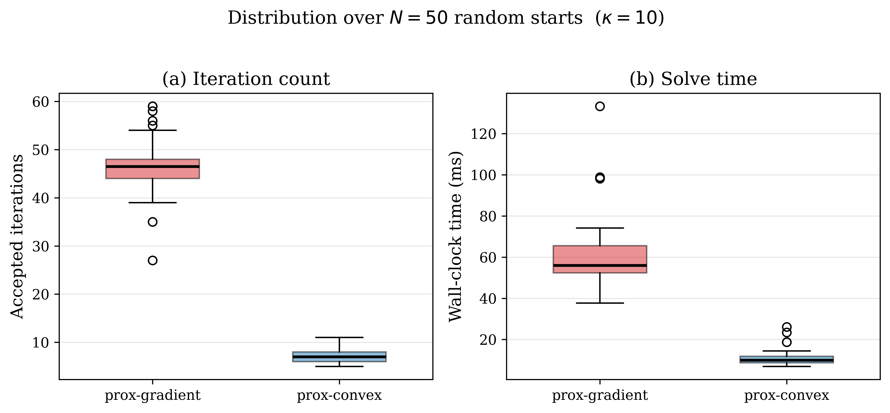
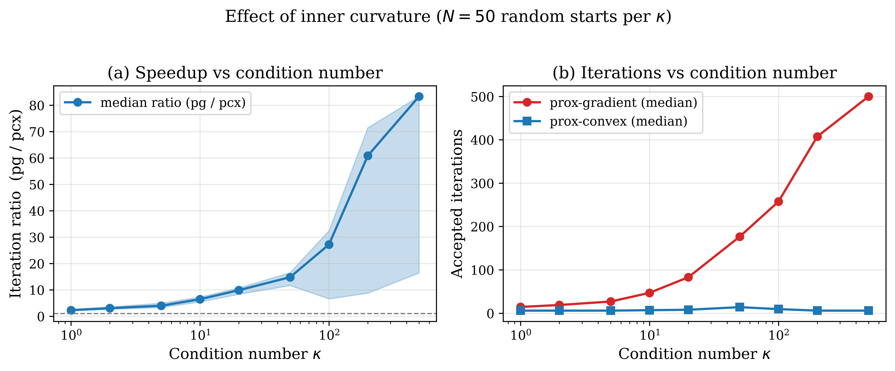
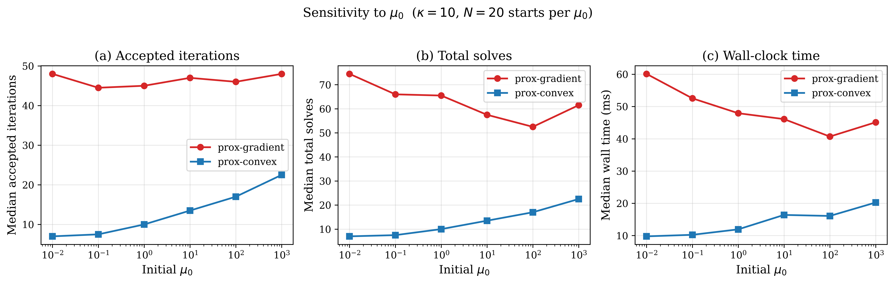

# prox-convex

Reference implementation and numerical experiments for **prox-convex**, a structure-preserving extension of prox-linear methods for composite optimization problems of the form

\[
F(x)=g(x)+h(c(x))+s(R(x)),
\]

where:

- `g` and `h` are convex,
- `c` and `s` are smooth,
- each component of `R` is convex, possibly nonsmooth.

The key idea of prox-convex is to **linearize only the smooth maps** while **preserving the existing convex structure**. In particular, instead of fully linearizing `s(R(x))`, prox-convex keeps the convex inner map `R` exact and linearizes only the outer smooth coupling `s`.


## Core implementation

### `pc_parse.py`
Builds the convex subproblem for each method:

- `prox_gradient`
- `prox_linear`
- `prox_convex`

The subproblem has the generic form

\[
\min_d \; \text{model}(x_k+d;x_k) + \tfrac12 \|d\|_{Q_k}^2,
\]

implemented with CVXPY variables and parameters.

### `pc_solve.py`
Provides the main solve loop with:

- optional use of generated code,
- adaptive proximal-weight update via predicted/actual reduction,
- tracking of accepted iterates, subproblem solves, timing, and convergence status.


## Examples included

### 1. One-dimensional model comparison
`run_p0.ipynb`

This notebook visualizes the local convex models for the nonsmooth objective

\[
f(x)=\left|\tfrac12 x^2+x\right|=|x|\,\left|1+\tfrac{x}{2}\right|,
\]

which admits both a prox-linear representation `h(c(x))` and a prox-convex representation `s(R(x))`.

It generates a figure comparing:

- the true objective,
- the prox-linear local model,
- the prox-convex local model.



*Convexified local models for the 1D example. The prox-convex surrogate preserves the kink structure and tracks the true objective more tightly than the prox-linear surrogate.*

### 2. Log-of-quadratic example
`run_p1_p2.ipynb`

This notebook studies

\[
F(x)=\log(Q(x))+8,
\qquad Q(x)=\|A(x-\bar x)\|^2+c,
\]

which can be represented both as:

- a prox-linear problem via `h(c(x)) = -\log(Q(x)^{-1}) + 8`, and
- a prox-convex problem via `s(R(x)) = \log(Q(x)) + 8`.

The notebook compares:

- prox-gradient,
- prox-linear,
- prox-convex,

in both fixed-weight and adaptive-weight settings.



*Adaptive convergence history for the log-of-quadratic example. Prox-convex converges in very few accepted iterations and maintains the smallest proximal weight.*



*Iterate trajectories over the level sets of the log-of-quadratic objective. Prox-convex follows a near-direct path to the minimizer, while prox-gradient and prox-linear require many smaller corrective steps.*

### 3. Product-of-quadratics benchmark
`run_p3.ipynb`

This is the main benchmark used in the paper. It considers the disjunctive-feasibility-type objective

\[
F(x)=R_1(x)R_2(x),
\qquad
R_i(x)=\tfrac12 (x-c_i)^\top P_i (x-c_i),
\]

where the condition that at least one nonnegative quadratic should be nonpositive is parameterized by requiring the product to vanish.

The notebook includes:

- single-run trajectory and convergence plots,
- distribution over random initializations,
- condition-number sweep,
- sensitivity to the initial proximal weight.



*Single-run convergence comparison on the main benchmark. Prox-convex reaches a minimizer in far fewer accepted iterations than the fully linearized baseline.*



*Iterate trajectories over the level sets of the product-of-quadratics objective. Prox-convex preserves the quadratic geometry of both channels and follows a more direct route to a global minimizer.*



*Distribution of accepted iterations and wall-clock time over random initializations. Prox-convex is both faster and more stable across starts.*



*Effect of increasing anisotropy of the quadratic channels. The advantage of prox-convex grows strongly with the condition number.*



*Sensitivity to the initial proximal weight. Prox-convex remains substantially better across a wide range of initialization values.*

## Citation

If you use this code, please cite the corresponding paper.

```bibtex
@article{uzun2025proximal,
  title={A Proximal Method for Composite Optimization with Smooth and Convex Components},
  author={Uzun, Samet and Luo, Dayou and A{\c{c}}{\i}kme{\c{s}}e, Beh{\c{c}}et and Aravkin, Aleksandr Y},
  journal={arXiv preprint arXiv:2512.20602},
  year={2025}
}
```
